## University Name - SJSU

## Course: Enterprise Software - CMPE172/ Fall 2020

### Team Members:

- Sarah Mai
- Grace To
- Kham Tran

### Project Introduction

Our project is designed to keep live online diary entries in a more user friendly way. Users are able to log-in with a google account and are only able to see and access diaries if logged in. When logging in the user is brought to a dashboard of all the user’s diary entries they had created. From there the user is able to create a diary entry; these entries may be made public or private as the user sees fit. A public diary entry allows other Diary Live users to freely read the diary entry but not edit any part of the writing, while a private entry is only available for the user themselves to see. All diary entries written by the user are editable by them allowing for the user to change or delete and of their own entries that they are necessary. Users are also able to see all public stories made by certain users just by clicking on their names and last but not least they are able to log out at any time with all their diary entries previously made still in their accounts.

### Sample Demo Screenshots:
Dairy Live Landing Page:
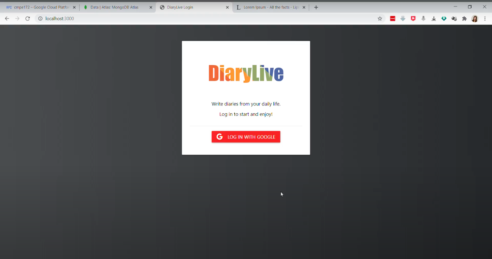

When logging in using your google account for first time userd the will be shown with an empty dashboard:
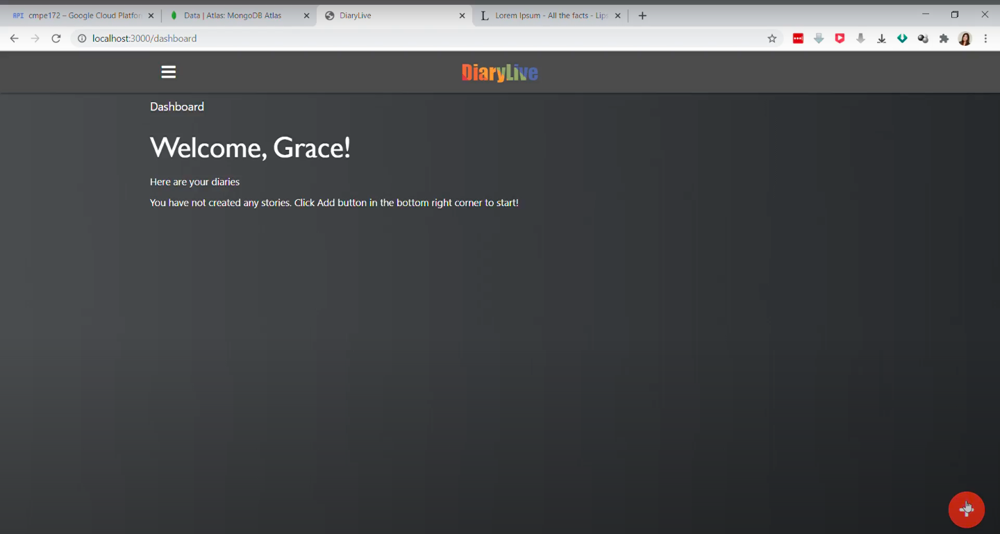

User are able to create a new Dairy entry:
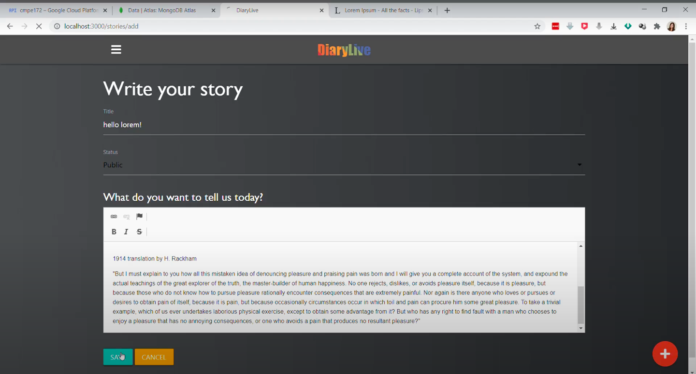

Published Entry:
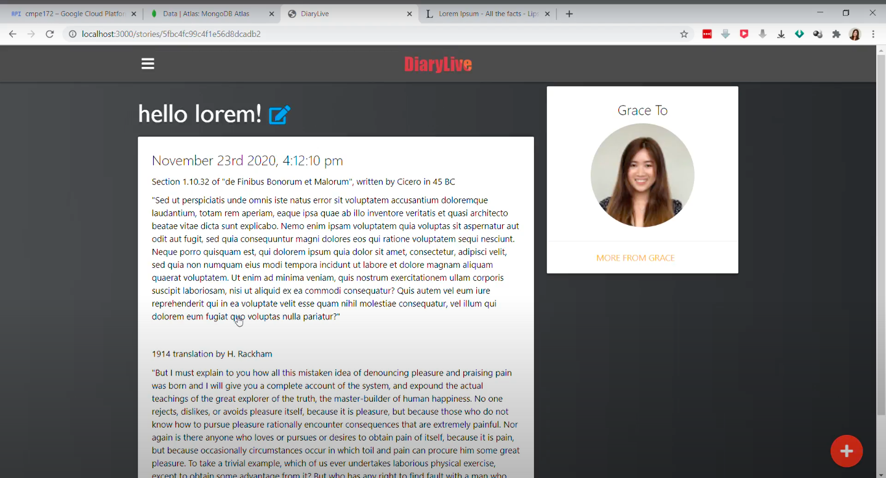

This is what the dashboard will look like with more entries the user can make Diary entry public or private to their choice:
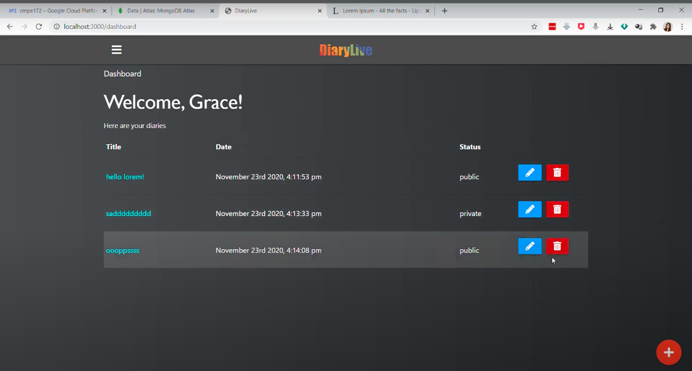

They may also be able to edit or delete their Diary entries as they see fit:
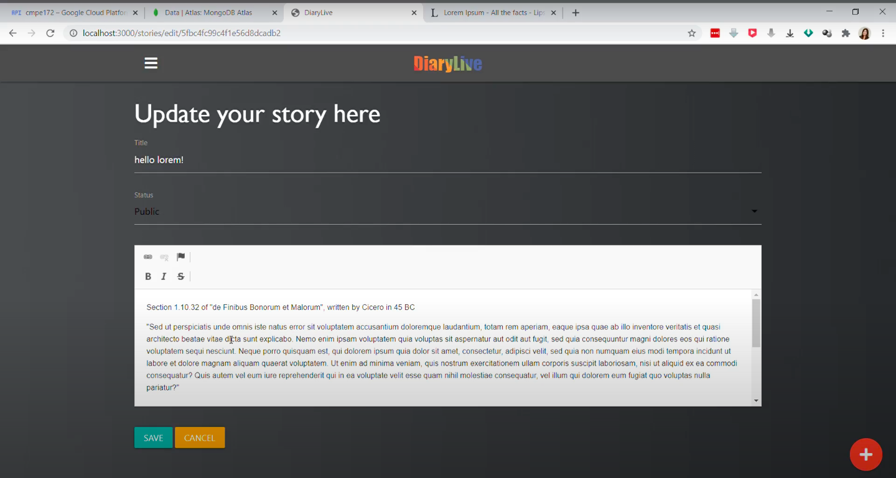

All users are able to see all public Diary entry:
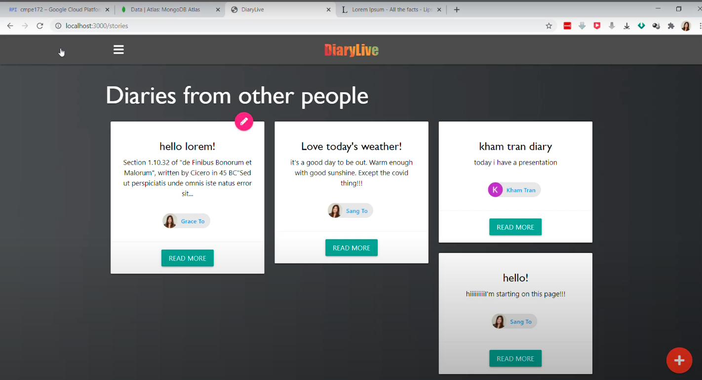

As well as view other Diary entries written by that user so long as they are public:
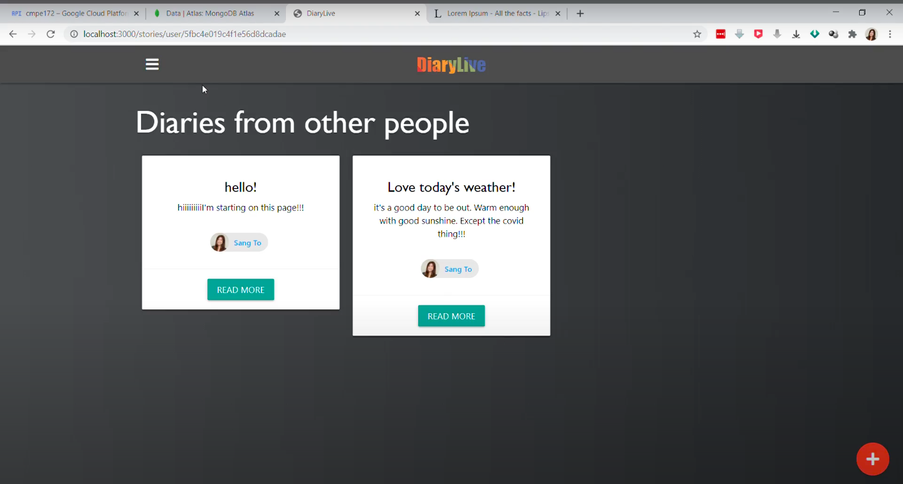

and finally there is a side bar menu in which users are able to nagvigate through pages and logout from Dairy Live:
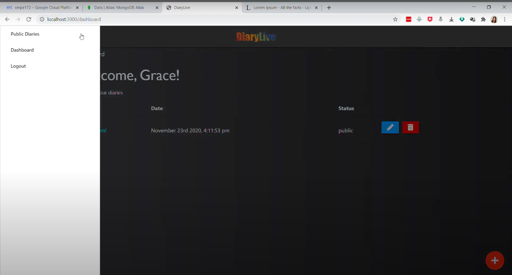

### Folder structure:

### Instructions on how to run the project locally.
  + Run by Docker:
     1. Pull command: docker pull kaylertran/diary-web-app:five
     2. Run command: docker run -p 3000:3000 kaylertran/diary-web-app:five
     3. Open browser and inser URL 'localhost:3000'
  
  + Run by NodeJS
     1. git clone https://github.com/sjsu-cmpe172-team9/diaries-live.git
     2. cd diaries-live
     3. npm install
     4. npm start
     5. Open browser and inser URL 'localhost:3000'

### System, Sequence, Interaction, and Database Schema Diagram
-System Diagram

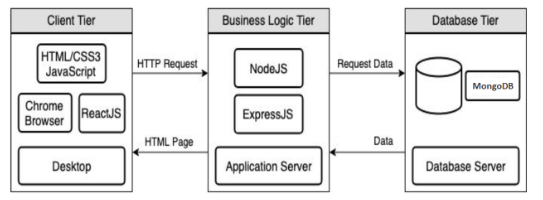

-Sequence Diagrams

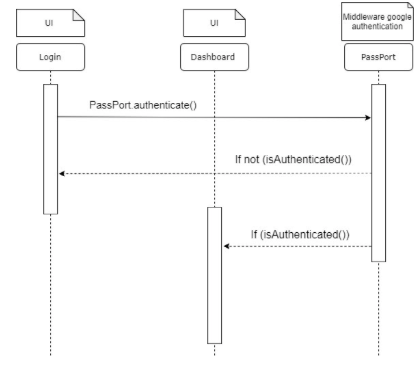
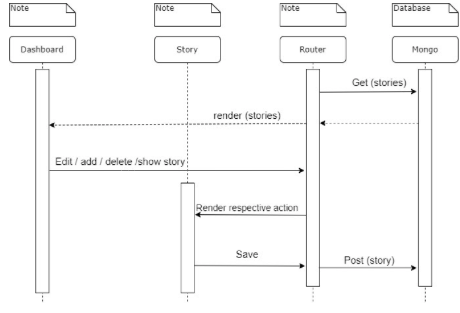

-Interaction

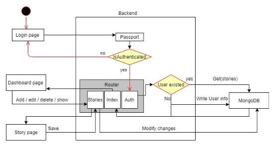

-Database Schema

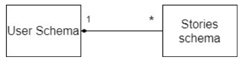
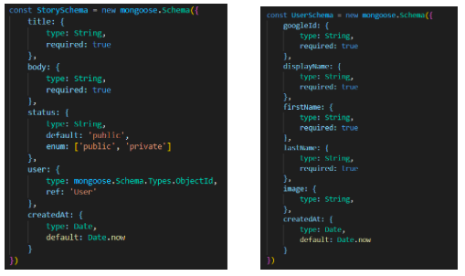

